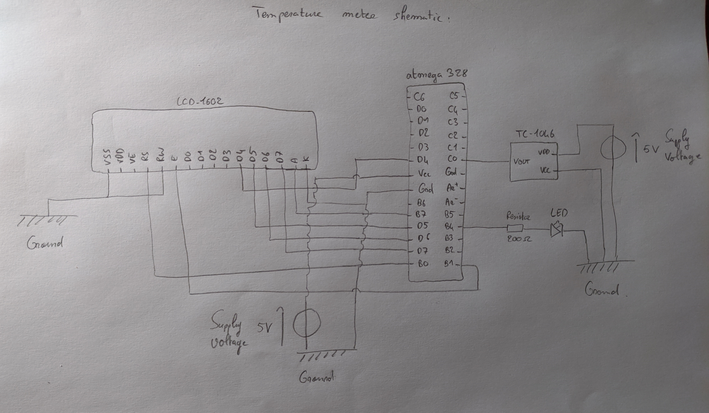
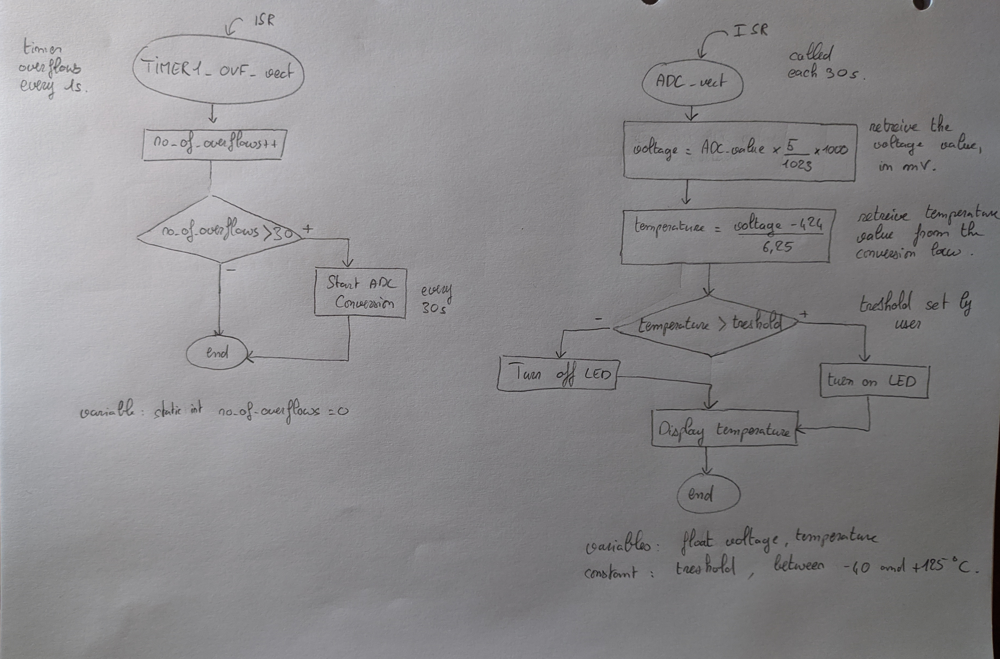

# Lab 5: THIBAULT SOURDIN

### Analog-to-Digital Conversion

1. Complete table with voltage divider, calculated, and measured ADC values for all five push buttons.

   | **Push button** | **PC0[A0] voltage** | **ADC value (calculated)** | **ADC value (measured)** | **ADC value (measured, hex)** |
   | :-: | :-: | :-: | :-: | :-: |
   | Right  | 0&nbsp;V                | 0          | 0   | 0   |
   | Up     | 0.495 or 0.708 &nbsp;V  | 101 or 144 | 143 | 8f  |
   | Down   | 1.203 or 1.610 &nbsp;V  | 246 or 329 | 342 | 156 |
   | Left   | 1.970 or 2.468 &nbsp;V  | 403 or 505 | 512 | 200 |
   | Select | 3.182 or 3.621 &nbsp;V  | 651 or 740 | 731 | 2dc |
   | none   | 5&nbsp;V                | 1023       | 1023 | 3ff |

### Temperature meter

Consider an application for temperature measurement. Use analog temperature sensor [TC1046](http://ww1.microchip.com/downloads/en/DeviceDoc/21496C.pdf), LCD, and a LED. Every 30 seconds, the temperature is measured and the value is displayed on LCD screen. When the temperature is too high, the LED will turn on.

2. Draw a schematic of temperature meter. The image can be drawn on a computer or by hand. Always name all components and their values.

   

3. Draw two flowcharts for interrupt handler `TIMER1_OVF_vect` (which overflows every 1&nbsp;sec) and `ADC_vect`. The image can be drawn on a computer or by hand. Use clear descriptions of the individual steps of the algorithms.

   